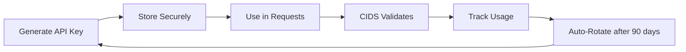
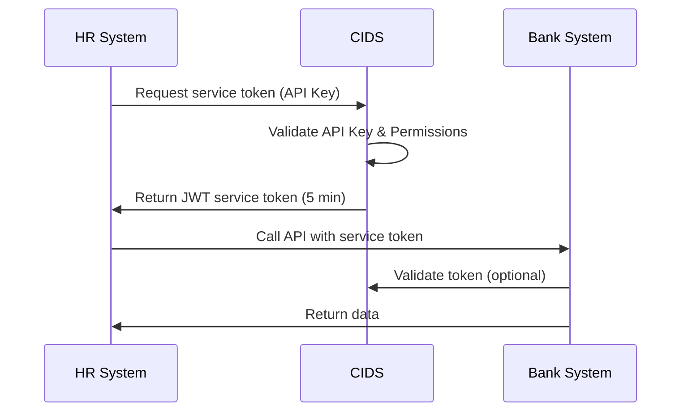
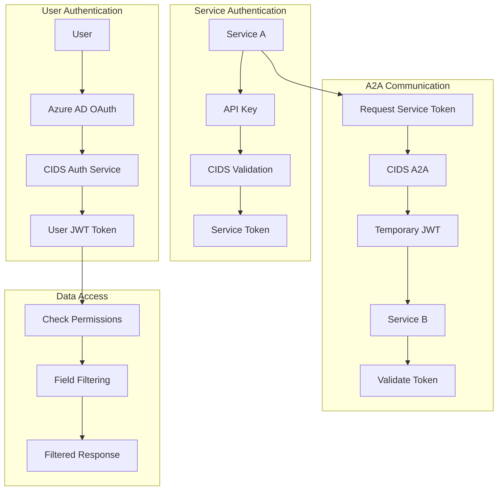
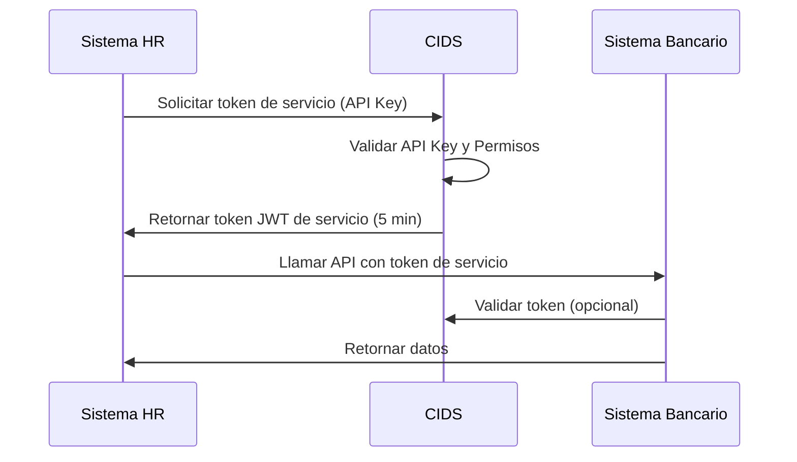

# CIDS Security Integration Guidelines / Guía de Integración de Seguridad CIDS
## Version 4.0 - Complete Integration Documentation / Versión 4.0 - Documentación Completa de Integración
### Last Updated / Última Actualización: 2025-01-15

---

# 🇬🇧 English Version

## Table of Contents
1. [Overview](#overview)
2. [Mandatory Requirements for CIDS Integration](#mandatory-requirements)
3. [Field Categories and Data Classification](#field-categories)
4. [API Keys Management](#api-keys)
5. [A2A (Application-to-Application) Authentication](#a2a-authentication)
6. [Public Keys and JWT Validation](#public-keys-jwt)
7. [Discovery Endpoints](#discovery-endpoints)
8. [Complete Implementation Examples](#implementation-examples)
9. [Security Architecture](#security-architecture)
10. [Troubleshooting](#troubleshooting)

---

## 1. Overview

CIDS (Centralized Identity Discovery Service) is a comprehensive authentication and authorization service that provides:

- **Centralized Authentication**: Single sign-on via Azure AD OAuth 2.0
- **Role-Based Access Control (RBAC)**: Granular permissions based on AD groups
- **Row-Level Security (RLS)**: SQL WHERE clause filters for data access
- **API Key Management**: Long-lived credentials for service identification
- **A2A Service Tokens**: Short-lived JWT tokens for microservices communication
- **Field-Level Permissions**: Control access to specific data categories (PII, SENSITIVE, FINANCIAL)

### Core Principles
- **Zero Trust Architecture**: Every request is validated independently
- **Defense in Depth**: Multiple security layers protect each service
- **Least Privilege**: Users and services get minimal necessary permissions
- **Complete Audit Trail**: All operations are logged for compliance
- **Field-Level Security**: Data categorization ensures proper data protection

## 2. Mandatory Requirements for CIDS Integration

### 2.1 Required Endpoints

Every CIDS-compliant application MUST implement these endpoints:

#### a) Discovery Endpoint (MANDATORY)
```python
@app.get("/discovery/endpoints")
async def discovery():
    """CIDS Discovery Endpoint - REQUIRED for all services"""
    return {
        "app_id": "app_fba7654e91e6413c",  # Must match registered client_id
        "app_name": "HR System",
        "version": "2.0",  # Must be 2.0 for field-level permissions
        "last_updated": "2025-01-15T10:00:00Z",
        "endpoints": [
            {
                "path": "/api/employees",
                "method": "GET",
                "permission": "employees.read",
                "response_fields": {
                    "base": ["employee_id", "department"],
                    "pii": ["full_name", "email", "phone"],
                    "sensitive": ["ssn", "medical_info"],
                    "financial": ["salary", "bank_account"]
                }
            }
        ]
    }
```

#### b) Health Check Endpoint (RECOMMENDED)
```python
@app.get("/health")
async def health_check():
    """Health check for monitoring"""
    return {
        "status": "healthy",
        "service": "HR System",
        "version": "1.0.0",
        "timestamp": datetime.utcnow().isoformat()
    }
```

### 2.2 Authentication Requirements

Applications must support ONE of these authentication methods:

#### Option 1: JWT Token Validation
```python
async def validate_jwt_token(authorization: str) -> Dict:
    """Validate JWT token with CIDS"""
    token = authorization.replace("Bearer ", "")

    # Get CIDS public keys
    jwks_response = await httpx.get(f"{CIDS_BASE_URL}/.well-known/jwks.json")

    # Validate token signature and claims
    decoded = jwt.decode(token, jwks_response.json(), algorithms=["RS256"])

    # Verify audience
    if APP_CLIENT_ID not in decoded.get("aud", []):
        raise HTTPException(403, "Token not intended for this service")

    return decoded
```

#### Option 2: API Key Authentication
```python
async def validate_api_key(x_api_key: str) -> Dict:
    """Validate API key with CIDS"""
    response = await httpx.get(
        f"{CIDS_BASE_URL}/auth/validate",
        headers={"X-API-Key": x_api_key}
    )

    if response.status_code != 200:
        raise HTTPException(401, "Invalid API key")

    return response.json()
```

### 2.3 Registration Requirements

Before integration, register your application with CIDS:

```bash
# Register application
POST /auth/admin/apps
{
    "client_id": "app_unique_identifier",
    "client_name": "Your Application Name",
    "service_url": "http://your-service:port",
    "discovery_endpoint": "/discovery/endpoints",
    "allowed_grant_types": ["authorization_code", "refresh_token"],
    "allowed_redirect_uris": ["http://your-app/callback"]
}
```

## 3. Field Categories and Data Classification

### 3.1 Field Categories

CIDS enforces field-level permissions based on data sensitivity:

| Category | Description | Examples | Permission Required |
|----------|-------------|----------|-------------------|
| **BASE** | Public/non-sensitive data | employee_id, department, office_location | `resource.read.base` |
| **PII** | Personally Identifiable Information | full_name, email, phone, address | `resource.read.pii` |
| **SENSITIVE** | Highly confidential data | SSN, medical_records, passwords | `resource.read.sensitive` |
| **FINANCIAL** | Financial information | salary, bank_account, tax_info | `resource.read.financial` |
| **WILDCARD** | All categories | All fields | `resource.read.wildcard` |

### 3.2 Implementation Example

```python
def filter_response_by_permissions(data: dict, permissions: list) -> dict:
    """Filter response based on user's field permissions"""
    allowed_fields = set()

    # Map permissions to field categories
    if "employees.read.base" in permissions:
        allowed_fields.update(["employee_id", "department"])

    if "employees.read.pii" in permissions:
        allowed_fields.update(["full_name", "email", "phone"])

    if "employees.read.sensitive" in permissions:
        allowed_fields.update(["ssn", "medical_info"])

    if "employees.read.financial" in permissions:
        allowed_fields.update(["salary", "bank_account"])

    if "employees.read.wildcard" in permissions:
        return data  # Return all fields

    # Filter data
    return {k: v for k, v in data.items() if k in allowed_fields}
```

### 3.3 Discovery Response with Field Categories

```json
{
    "app_id": "app_fba7654e91e6413c",
    "version": "2.0",
    "endpoints": [
        {
            "path": "/api/employees/{id}",
            "method": "GET",
            "permission": "employees.read",
            "response_fields": {
                "base": ["employee_id", "department", "hire_date"],
                "pii": ["full_name", "email", "phone", "address"],
                "sensitive": ["ssn", "medical_conditions", "emergency_contacts"],
                "financial": ["salary", "bonus", "stock_options", "bank_account"]
            },
            "description": "Get employee details with field-level filtering"
        }
    ]
}
```

## 4. API Keys Management

### 4.1 API Key Lifecycle



### 4.2 API Key Format and Generation

```bash
# Format: cids_ak_{32_character_alphanumeric}
cids_ak_WoQFlNG8ckBg6ve9NuvB12XeABLs30qV

# Generation (Admin only)
POST /auth/admin/apps/{client_id}/api-key
Authorization: Bearer {admin_token}

Response:
{
    "api_key": "cids_ak_WoQFlNG8ckBg6ve9NuvB12XeABLs30qV",
    "client_id": "app_fba7654e91e6413c",
    "created_at": "2025-01-15T10:00:00Z",
    "expires_at": "2025-04-15T10:00:00Z"
}
```

### 4.3 Using API Keys

```python
# Configuration
import os
from dotenv import load_dotenv

load_dotenv()

CIDS_API_KEY = os.getenv("CIDS_API_KEY")  # Never hardcode!

# In requests
async def make_authenticated_request():
    headers = {
        "X-API-Key": CIDS_API_KEY,
        "Content-Type": "application/json"
    }

    response = await httpx.get(
        "https://api.example.com/data",
        headers=headers
    )

    return response.json()
```

### 4.4 API Key Security Best Practices

1. **Environment Variables**: Never hardcode API keys
2. **Rotation**: Rotate every 90 days
3. **Monitoring**: Track usage patterns
4. **IP Restrictions**: Whitelist source IPs when possible
5. **Immediate Revocation**: On any suspected compromise

## 5. A2A (Application-to-Application) Authentication

### 5.1 A2A Flow Diagram



### 5.2 Complete A2A Implementation

#### Step 1: Request Service Token
```python
async def get_service_token(target_client_id: str, scopes: list) -> str:
    """Get A2A service token from CIDS"""

    response = await httpx.post(
        f"{CIDS_BASE_URL}/auth/service-token",
        headers={
            "X-API-Key": HR_API_KEY,
            "Content-Type": "application/json"
        },
        json={
            "target_client_id": target_client_id,
            "requested_scopes": scopes,
            "duration": 300,  # 5 minutes
            "purpose": "Data synchronization"
        }
    )

    if response.status_code != 200:
        raise Exception(f"Failed to get service token: {response.text}")

    return response.json()["token"]
```

#### Step 2: Use Service Token
```python
async def call_bank_api(employee_email: str) -> dict:
    """Call Bank API using A2A token"""

    # Get service token
    service_token = await get_service_token(
        target_client_id="app_aba3d3708aed4926",  # Bank System
        scopes=["accounts.read", "accounts.balance"]
    )

    # Call Bank API
    response = await httpx.get(
        f"http://bank-system:8006/accounts/by-email/{employee_email}/balance",
        headers={
            "Authorization": f"Bearer {service_token}"
        }
    )

    return response.json()
```

### 5.3 A2A Security Features

1. **Short-lived tokens**: 5-10 minutes maximum
2. **Audience validation**: Token only valid for specified service
3. **Scope restrictions**: Limited to requested permissions
4. **Audit logging**: Every A2A interaction logged
5. **No shared secrets**: Services never share API keys

### 5.4 Real-World Example: HR to Bank Integration

```python
# Complete endpoint in HR System
@app.get("/api/bank-balance")
async def get_bank_balance(token_data: Dict = Depends(require_auth)):
    """Get bank balance using A2A communication"""

    user_email = token_data.get("email", "")

    try:
        # Step 1: Get A2A token
        async with httpx.AsyncClient() as client:
            token_response = await client.post(
                "http://cids:8001/auth/service-token",
                headers={"X-API-Key": HR_API_KEY},
                json={
                    "target_client_id": BANK_CLIENT_ID,
                    "requested_scopes": ["accounts.read", "accounts.balance"],
                    "duration": 300,
                    "purpose": f"Balance query for {user_email}"
                }
            )

            service_token = token_response.json()["token"]

            # Step 2: Call Bank API
            bank_response = await client.get(
                f"http://bank-system:8006/accounts/by-email/{user_email}/balance",
                headers={"Authorization": f"Bearer {service_token}"}
            )

            return bank_response.json()

    except Exception as e:
        raise HTTPException(500, f"A2A communication failed: {str(e)}")
```

## 6. Public Keys and JWT Validation

### 6.1 JWKS Endpoint

CIDS exposes public keys at:
```
GET /.well-known/jwks.json
```

Response:
```json
{
    "keys": [
        {
            "kty": "RSA",
            "use": "sig",
            "kid": "auth-service-key-1",
            "n": "xGOr-H7A-PWG...",
            "e": "AQAB",
            "alg": "RS256"
        }
    ]
}
```

### 6.2 JWT Token Structure

```json
{
    "header": {
        "alg": "RS256",
        "kid": "auth-service-key-1",
        "typ": "JWT"
    },
    "payload": {
        "iss": "internal-auth-service",
        "sub": "user_id_or_service_id",
        "aud": ["app_client_id"],
        "exp": 1234567890,
        "iat": 1234567890,
        "email": "user@example.com",
        "roles": {
            "app_id": ["Admin", "User"]
        },
        "permissions": {
            "app_id": [
                "employees.read.base",
                "employees.read.pii",
                "employees.read.financial"
            ]
        },
        "rls_filters": {
            "department": "IT OR HR",
            "region": "US"
        }
    }
}
```

### 6.3 Token Validation Implementation

```python
import jwt
from cryptography.hazmat.primitives import serialization
from cryptography.hazmat.primitives.asymmetric import rsa

async def validate_token(token: str) -> dict:
    """Complete JWT validation"""

    # 1. Get JWKS from CIDS
    jwks_response = await httpx.get(f"{CIDS_BASE_URL}/.well-known/jwks.json")
    jwks = jwks_response.json()

    # 2. Decode header to get kid
    header = jwt.get_unverified_header(token)
    kid = header.get("kid")

    # 3. Find matching key
    public_key = None
    for key in jwks["keys"]:
        if key["kid"] == kid:
            public_key = jwt.algorithms.RSAAlgorithm.from_jwk(json.dumps(key))
            break

    if not public_key:
        raise ValueError("No matching key found")

    # 4. Validate token
    decoded = jwt.decode(
        token,
        public_key,
        algorithms=["RS256"],
        audience=APP_CLIENT_ID,
        issuer="internal-auth-service"
    )

    # 5. Additional validations
    if decoded["exp"] < time.time():
        raise ValueError("Token expired")

    return decoded
```

## 7. Discovery Endpoints

### 7.1 Discovery Response Format v2.0

```python
def get_discovery_response():
    """Generate CIDS-compliant discovery response"""
    return {
        "app_id": APP_CLIENT_ID,  # MUST match registered client_id
        "app_name": "HR System",
        "version": "2.0",  # MUST be 2.0 for field-level permissions
        "last_updated": datetime.utcnow().isoformat() + "Z",
        "base_url": "http://hr-system:8005",
        "authentication": {
            "type": "oauth2",
            "token_endpoint": "/auth/token",
            "supported_grants": ["authorization_code", "refresh_token"]
        },
        "endpoints": [
            {
                "path": "/api/employees",
                "method": "GET",
                "permission": "employees.read",
                "description": "List all employees",
                "response_fields": {
                    "base": ["employee_id", "department", "hire_date"],
                    "pii": ["full_name", "email", "phone"],
                    "sensitive": ["ssn"],
                    "financial": ["salary", "bonus"]
                },
                "query_params": [
                    {"name": "department", "type": "string", "required": False},
                    {"name": "limit", "type": "integer", "required": False}
                ]
            },
            {
                "path": "/api/employees/{employee_id}",
                "method": "GET",
                "permission": "employees.read",
                "description": "Get employee details",
                "path_params": [
                    {"name": "employee_id", "type": "string", "required": True}
                ],
                "response_fields": {
                    "base": ["employee_id", "department"],
                    "pii": ["full_name", "email", "phone", "address"],
                    "sensitive": ["ssn", "medical_info"],
                    "financial": ["salary", "bank_account", "tax_info"]
                }
            },
            {
                "path": "/api/payments",
                "method": "POST",
                "permission": "payments.write",
                "description": "Process payment",
                "request_body": {
                    "employee_id": "string",
                    "amount": "number",
                    "payment_type": "string"
                },
                "response_fields": {
                    "base": ["payment_id", "status"],
                    "financial": ["amount", "transaction_id"]
                }
            }
        ],
        "field_categories": {
            "BASE": "Non-sensitive operational data",
            "PII": "Personally Identifiable Information",
            "SENSITIVE": "Highly confidential data (SSN, medical)",
            "FINANCIAL": "Financial and payment information"
        }
    }
```

### 7.2 Discovery Validation

CIDS validates discovery responses:

```python
def validate_discovery_response(response: dict) -> bool:
    """Validate discovery response format"""

    # Required fields
    required = ["app_id", "app_name", "version", "last_updated", "endpoints"]
    for field in required:
        if field not in response:
            raise ValueError(f"Missing required field: {field}")

    # Version must be 2.0 for field-level permissions
    if response["version"] != "2.0":
        raise ValueError("Version must be 2.0 for field-level permissions")

    # app_id must match registered client_id
    if response["app_id"] != registered_client_id:
        raise ValueError("app_id must match registered client_id")

    # Validate each endpoint
    for endpoint in response["endpoints"]:
        if "response_fields" not in endpoint:
            raise ValueError(f"Endpoint {endpoint['path']} missing response_fields")

        # Validate field categories
        valid_categories = ["base", "pii", "sensitive", "financial"]
        for category in endpoint["response_fields"]:
            if category not in valid_categories:
                raise ValueError(f"Invalid field category: {category}")

    return True
```

## 8. Complete Implementation Examples

### 8.1 HR System Complete Implementation

```python
# src/main.py
from fastapi import FastAPI, Depends, HTTPException, Header
from typing import Optional, Dict
import httpx
import jwt
import os

app = FastAPI(title="HR System")

# Configuration
APP_CLIENT_ID = "app_fba7654e91e6413c"
CIDS_BASE_URL = "http://cids:8001"
HR_API_KEY = os.getenv("HR_API_KEY")

# Authentication dependency
async def require_auth(authorization: Optional[str] = Header(None),
                       x_api_key: Optional[str] = Header(None)) -> Dict:
    """Support both JWT and API Key authentication"""

    if authorization and authorization.startswith("Bearer "):
        return await validate_jwt_token(authorization)
    elif x_api_key:
        return await validate_api_key(x_api_key)
    else:
        raise HTTPException(401, "No authentication provided")

# JWT validation
async def validate_jwt_token(authorization: str) -> Dict:
    """Validate JWT with CIDS public keys"""
    token = authorization.replace("Bearer ", "")

    async with httpx.AsyncClient() as client:
        # Get public keys
        jwks_response = await client.get(f"{CIDS_BASE_URL}/.well-known/jwks.json")

        # Decode and validate
        # ... (validation code as shown above)

        return decoded_token

# Discovery endpoint (MANDATORY)
@app.get("/discovery/endpoints")
async def discovery():
    """CIDS Discovery Endpoint"""
    return {
        "app_id": APP_CLIENT_ID,
        "app_name": "HR System",
        "version": "2.0",
        "last_updated": datetime.utcnow().isoformat() + "Z",
        "endpoints": [
            {
                "path": "/api/employees",
                "method": "GET",
                "permission": "employees.read",
                "response_fields": {
                    "base": ["employee_id", "department"],
                    "pii": ["full_name", "email"],
                    "sensitive": ["ssn"],
                    "financial": ["salary"]
                }
            }
        ]
    }

# Protected endpoint with field filtering
@app.get("/api/employees")
async def list_employees(token_data: Dict = Depends(require_auth)):
    """List employees with field-level filtering"""

    # Get user's permissions
    permissions = token_data.get("permissions", {}).get(APP_CLIENT_ID, [])

    # Get all employee data
    employees = [
        {
            "employee_id": "EMP001",
            "department": "IT",
            "full_name": "John Doe",
            "email": "john@company.com",
            "ssn": "123-45-6789",
            "salary": 75000
        }
    ]

    # Filter based on permissions
    filtered_employees = []
    for emp in employees:
        filtered_emp = {}

        # Always include base fields
        if "employees.read.base" in permissions or "employees.read.wildcard" in permissions:
            filtered_emp.update({
                "employee_id": emp["employee_id"],
                "department": emp["department"]
            })

        # Include PII if permitted
        if "employees.read.pii" in permissions or "employees.read.wildcard" in permissions:
            filtered_emp.update({
                "full_name": emp["full_name"],
                "email": emp["email"]
            })

        # Include sensitive if permitted
        if "employees.read.sensitive" in permissions or "employees.read.wildcard" in permissions:
            filtered_emp["ssn"] = emp["ssn"]

        # Include financial if permitted
        if "employees.read.financial" in permissions or "employees.read.wildcard" in permissions:
            filtered_emp["salary"] = emp["salary"]

        filtered_employees.append(filtered_emp)

    return {"employees": filtered_employees}

# A2A endpoint example
@app.get("/api/bank-balance")
async def get_bank_balance(token_data: Dict = Depends(require_auth)):
    """Get bank balance using A2A communication"""

    user_email = token_data.get("email", "")

    async with httpx.AsyncClient() as client:
        # Get A2A service token
        token_response = await client.post(
            f"{CIDS_BASE_URL}/auth/service-token",
            headers={"X-API-Key": HR_API_KEY},
            json={
                "target_client_id": "app_aba3d3708aed4926",
                "requested_scopes": ["accounts.read", "accounts.balance"],
                "duration": 300,
                "purpose": f"Balance query for {user_email}"
            }
        )

        service_token = token_response.json()["token"]

        # Call Bank API with service token
        bank_response = await client.get(
            f"http://bank-system:8006/accounts/by-email/{user_email}/balance",
            headers={"Authorization": f"Bearer {service_token}"}
        )

        return bank_response.json()
```

### 8.2 Bank System Implementation

```python
# Bank System implementation
@app.get("/accounts/by-email/{email}/balance")
async def get_balance_by_email(
    email: str,
    service_info: Dict = Depends(require_auth)
):
    """Get account balance by email - A2A endpoint"""

    # Verify the token is intended for us
    audience = service_info.get("aud", [])
    if APP_CLIENT_ID not in audience:
        raise HTTPException(403, "Token not intended for this service")

    # Get account from database
    account = db.get_account_by_email(email)

    if not account:
        raise HTTPException(404, f"No account found for {email}")

    # Return balance information
    return {
        "employee_id": account["employee_id"],
        "email": email,
        "balance": account["balance"],
        "account_type": account["account_type"],
        "last_updated": account["updated_at"]
    }
```

## 9. Security Architecture

### 9.1 Complete Security Flow



### 9.2 Security Layers

1. **Network Security**
   - TLS/HTTPS for all communications
   - Network segmentation
   - Firewall rules

2. **Authentication**
   - Azure AD OAuth 2.0
   - API Key validation
   - JWT token verification

3. **Authorization**
   - Role-based access control (RBAC)
   - Field-level permissions
   - Row-level security (RLS)

4. **Data Protection**
   - Field categorization (BASE, PII, SENSITIVE, FINANCIAL)
   - Encryption at rest
   - Encryption in transit

5. **Audit & Compliance**
   - Complete audit trail
   - Access logging
   - Compliance reporting

## 10. Troubleshooting

### 10.1 Common Issues and Solutions

| Issue | Cause | Solution |
|-------|-------|----------|
| "Token not intended for this service" | Wrong audience in JWT | Verify `aud` claim matches your client_id |
| "Invalid API key" | Expired or wrong key | Generate new API key via CIDS admin |
| "No matching key found" | JWT kid not in JWKS | CIDS may have rotated keys, retry |
| Discovery 422 error | app_id mismatch | Ensure app_id equals registered client_id |
| Missing fields in response | Insufficient permissions | Check user has required field permissions |
| A2A token expired | Token lifetime too short | Request longer duration (max 600 seconds) |

### 10.2 Debug Checklist

- [ ] Service registered in CIDS?
- [ ] Discovery endpoint accessible?
- [ ] Discovery version is 2.0?
- [ ] API key is active and not expired?
- [ ] JWT audience matches your client_id?
- [ ] User has necessary field permissions?
- [ ] A2A permissions configured in CIDS?
- [ ] Service URLs are correct in docker network?

### 10.3 Testing Commands

```bash
# Test discovery endpoint
curl http://your-service:port/discovery/endpoints

# Test with API key
curl -H "X-API-Key: cids_ak_xxx" http://your-service:port/api/data

# Test A2A flow
./test_a2a_flow.sh

# Check CIDS logs
docker logs cid-backend --tail 100

# Verify JWT token
jwt decode eyJhbGci...
```

---

# 🇪🇸 Versión en Español

## Tabla de Contenidos
1. [Visión General](#vision-general)
2. [Requisitos Obligatorios para Integración CIDS](#requisitos-obligatorios)
3. [Categorías de Campos y Clasificación de Datos](#categorias-campos)
4. [Gestión de API Keys](#gestion-api-keys)
5. [Autenticación A2A (Aplicación a Aplicación)](#autenticacion-a2a)
6. [Claves Públicas y Validación JWT](#claves-publicas-jwt-es)
7. [Endpoints de Descubrimiento](#endpoints-descubrimiento)
8. [Ejemplos Completos de Implementación](#ejemplos-implementacion)
9. [Arquitectura de Seguridad](#arquitectura-seguridad-es)
10. [Resolución de Problemas](#resolucion-problemas)

---

## 1. Visión General

CIDS (Servicio Centralizado de Identidad y Descubrimiento) es un servicio integral de autenticación y autorización que proporciona:

- **Autenticación Centralizada**: Inicio de sesión único vía Azure AD OAuth 2.0
- **Control de Acceso Basado en Roles (RBAC)**: Permisos granulares basados en grupos de AD
- **Seguridad a Nivel de Fila (RLS)**: Filtros SQL WHERE para acceso a datos
- **Gestión de API Keys**: Credenciales de larga duración para identificación de servicios
- **Tokens de Servicio A2A**: Tokens JWT de corta duración para comunicación entre microservicios
- **Permisos a Nivel de Campo**: Control de acceso a categorías específicas de datos (PII, SENSITIVE, FINANCIAL)

### Principios Fundamentales
- **Arquitectura Zero Trust**: Cada solicitud se valida independientemente
- **Defensa en Profundidad**: Múltiples capas de seguridad protegen cada servicio
- **Privilegio Mínimo**: Usuarios y servicios obtienen permisos mínimos necesarios
- **Rastro de Auditoría Completo**: Todas las operaciones se registran para cumplimiento
- **Seguridad a Nivel de Campo**: La categorización de datos asegura protección adecuada

## 2. Requisitos Obligatorios para Integración CIDS

### 2.1 Endpoints Requeridos

Toda aplicación compatible con CIDS DEBE implementar estos endpoints:

#### a) Endpoint de Descubrimiento (OBLIGATORIO)
```python
@app.get("/discovery/endpoints")
async def discovery():
    """Endpoint de Descubrimiento CIDS - REQUERIDO para todos los servicios"""
    return {
        "app_id": "app_fba7654e91e6413c",  # Debe coincidir con client_id registrado
        "app_name": "Sistema HR",
        "version": "2.0",  # Debe ser 2.0 para permisos a nivel de campo
        "last_updated": "2025-01-15T10:00:00Z",
        "endpoints": [
            {
                "path": "/api/empleados",
                "method": "GET",
                "permission": "empleados.read",
                "response_fields": {
                    "base": ["id_empleado", "departamento"],
                    "pii": ["nombre_completo", "email", "telefono"],
                    "sensitive": ["ssn", "info_medica"],
                    "financial": ["salario", "cuenta_bancaria"]
                }
            }
        ]
    }
```

#### b) Endpoint de Verificación de Salud (RECOMENDADO)
```python
@app.get("/health")
async def health_check():
    """Verificación de salud para monitoreo"""
    return {
        "status": "saludable",
        "servicio": "Sistema HR",
        "version": "1.0.0",
        "timestamp": datetime.utcnow().isoformat()
    }
```

### 2.2 Requisitos de Autenticación

Las aplicaciones deben soportar UNO de estos métodos de autenticación:

#### Opción 1: Validación de Token JWT
```python
async def validar_token_jwt(authorization: str) -> Dict:
    """Validar token JWT con CIDS"""
    token = authorization.replace("Bearer ", "")

    # Obtener claves públicas de CIDS
    respuesta_jwks = await httpx.get(f"{CIDS_BASE_URL}/.well-known/jwks.json")

    # Validar firma y claims del token
    decodificado = jwt.decode(token, respuesta_jwks.json(), algorithms=["RS256"])

    # Verificar audiencia
    if APP_CLIENT_ID not in decodificado.get("aud", []):
        raise HTTPException(403, "Token no destinado para este servicio")

    return decodificado
```

#### Opción 2: Autenticación con API Key
```python
async def validar_api_key(x_api_key: str) -> Dict:
    """Validar API key con CIDS"""
    respuesta = await httpx.get(
        f"{CIDS_BASE_URL}/auth/validate",
        headers={"X-API-Key": x_api_key}
    )

    if respuesta.status_code != 200:
        raise HTTPException(401, "API key inválida")

    return respuesta.json()
```

### 2.3 Requisitos de Registro

Antes de la integración, registre su aplicación con CIDS:

```bash
# Registrar aplicación
POST /auth/admin/apps
{
    "client_id": "app_identificador_unico",
    "client_name": "Nombre de Su Aplicación",
    "service_url": "http://su-servicio:puerto",
    "discovery_endpoint": "/discovery/endpoints",
    "allowed_grant_types": ["authorization_code", "refresh_token"],
    "allowed_redirect_uris": ["http://su-app/callback"]
}
```

## 3. Categorías de Campos y Clasificación de Datos

### 3.1 Categorías de Campos

CIDS aplica permisos a nivel de campo basados en la sensibilidad de los datos:

| Categoría | Descripción | Ejemplos | Permiso Requerido |
|-----------|-------------|----------|-------------------|
| **BASE** | Datos públicos/no sensibles | id_empleado, departamento, ubicación_oficina | `recurso.read.base` |
| **PII** | Información Personal Identificable | nombre_completo, email, teléfono, dirección | `recurso.read.pii` |
| **SENSITIVE** | Datos altamente confidenciales | SSN, registros_médicos, contraseñas | `recurso.read.sensitive` |
| **FINANCIAL** | Información financiera | salario, cuenta_bancaria, info_fiscal | `recurso.read.financial` |
| **WILDCARD** | Todas las categorías | Todos los campos | `recurso.read.wildcard` |

### 3.2 Ejemplo de Implementación

```python
def filtrar_respuesta_por_permisos(datos: dict, permisos: list) -> dict:
    """Filtrar respuesta basada en permisos de campo del usuario"""
    campos_permitidos = set()

    # Mapear permisos a categorías de campos
    if "empleados.read.base" in permisos:
        campos_permitidos.update(["id_empleado", "departamento"])

    if "empleados.read.pii" in permisos:
        campos_permitidos.update(["nombre_completo", "email", "telefono"])

    if "empleados.read.sensitive" in permisos:
        campos_permitidos.update(["ssn", "info_medica"])

    if "empleados.read.financial" in permisos:
        campos_permitidos.update(["salario", "cuenta_bancaria"])

    if "empleados.read.wildcard" in permisos:
        return datos  # Retornar todos los campos

    # Filtrar datos
    return {k: v for k, v in datos.items() if k in campos_permitidos}
```

### 3.3 Respuesta de Descubrimiento con Categorías de Campos

```json
{
    "app_id": "app_fba7654e91e6413c",
    "version": "2.0",
    "endpoints": [
        {
            "path": "/api/empleados/{id}",
            "method": "GET",
            "permission": "empleados.read",
            "response_fields": {
                "base": ["id_empleado", "departamento", "fecha_contratacion"],
                "pii": ["nombre_completo", "email", "telefono", "direccion"],
                "sensitive": ["ssn", "condiciones_medicas", "contactos_emergencia"],
                "financial": ["salario", "bonos", "opciones_acciones", "cuenta_bancaria"]
            },
            "descripcion": "Obtener detalles del empleado con filtrado a nivel de campo"
        }
    ]
}
```

## 4. Gestión de API Keys

### 4.1 Ciclo de Vida de API Key

```mermaid
graph LR
    A[Generar API Key] --> B[Almacenar Seguramente]
    B --> C[Usar en Solicitudes]
    C --> D[CIDS Valida]
    D --> E[Rastrear Uso]
    E --> F[Auto-Rotar después de 90 días]
    F --> A
```



### 4.2 Formato y Generación de API Key

```bash
# Formato: cids_ak_{32_caracteres_alfanuméricos}
cids_ak_WoQFlNG8ckBg6ve9NuvB12XeABLs30qV

# Generación (Solo Admin)
POST /auth/admin/apps/{client_id}/api-key
Authorization: Bearer {token_admin}

Respuesta:
{
    "api_key": "cids_ak_WoQFlNG8ckBg6ve9NuvB12XeABLs30qV",
    "client_id": "app_fba7654e91e6413c",
    "created_at": "2025-01-15T10:00:00Z",
    "expires_at": "2025-04-15T10:00:00Z"
}
```

### 4.3 Uso de API Keys

```python
# Configuración
import os
from dotenv import load_dotenv

load_dotenv()

CIDS_API_KEY = os.getenv("CIDS_API_KEY")  # ¡Nunca hardcodear!

# En solicitudes
async def hacer_solicitud_autenticada():
    headers = {
        "X-API-Key": CIDS_API_KEY,
        "Content-Type": "application/json"
    }

    respuesta = await httpx.get(
        "https://api.ejemplo.com/datos",
        headers=headers
    )

    return respuesta.json()
```

### 4.4 Mejores Prácticas de Seguridad para API Keys

1. **Variables de Entorno**: Nunca hardcodear API keys
2. **Rotación**: Rotar cada 90 días
3. **Monitoreo**: Rastrear patrones de uso
4. **Restricciones IP**: Lista blanca de IPs origen cuando sea posible
5. **Revocación Inmediata**: Ante cualquier sospecha de compromiso

## 5. Autenticación A2A (Aplicación a Aplicación)

### 5.1 Diagrama de Flujo A2A



### 5.2 Implementación Completa A2A

#### Paso 1: Solicitar Token de Servicio
```python
async def obtener_token_servicio(client_id_destino: str, scopes: list) -> str:
    """Obtener token de servicio A2A de CIDS"""

    respuesta = await httpx.post(
        f"{CIDS_BASE_URL}/auth/service-token",
        headers={
            "X-API-Key": HR_API_KEY,
            "Content-Type": "application/json"
        },
        json={
            "target_client_id": client_id_destino,
            "requested_scopes": scopes,
            "duration": 300,  # 5 minutos
            "purpose": "Sincronización de datos"
        }
    )

    if respuesta.status_code != 200:
        raise Exception(f"Fallo al obtener token de servicio: {respuesta.text}")

    return respuesta.json()["token"]
```

#### Paso 2: Usar Token de Servicio
```python
async def llamar_api_banco(email_empleado: str) -> dict:
    """Llamar API del Banco usando token A2A"""

    # Obtener token de servicio
    token_servicio = await obtener_token_servicio(
        client_id_destino="app_aba3d3708aed4926",  # Sistema Bancario
        scopes=["cuentas.read", "cuentas.balance"]
    )

    # Llamar API del Banco
    respuesta = await httpx.get(
        f"http://sistema-banco:8006/cuentas/por-email/{email_empleado}/balance",
        headers={
            "Authorization": f"Bearer {token_servicio}"
        }
    )

    return respuesta.json()
```

### 5.3 Características de Seguridad A2A

1. **Tokens de corta duración**: 5-10 minutos máximo
2. **Validación de audiencia**: Token solo válido para servicio especificado
3. **Restricciones de alcance**: Limitado a permisos solicitados
4. **Registro de auditoría**: Cada interacción A2A registrada
5. **Sin secretos compartidos**: Los servicios nunca comparten API keys

### 5.4 Ejemplo Real: Integración HR a Banco

```python
# Endpoint completo en Sistema HR
@app.get("/api/balance-bancario")
async def obtener_balance_bancario(datos_token: Dict = Depends(require_auth)):
    """Obtener balance bancario usando comunicación A2A"""

    email_usuario = datos_token.get("email", "")

    try:
        # Paso 1: Obtener token A2A
        async with httpx.AsyncClient() as client:
            respuesta_token = await client.post(
                "http://cids:8001/auth/service-token",
                headers={"X-API-Key": HR_API_KEY},
                json={
                    "target_client_id": BANK_CLIENT_ID,
                    "requested_scopes": ["cuentas.read", "cuentas.balance"],
                    "duration": 300,
                    "purpose": f"Consulta de balance para {email_usuario}"
                }
            )

            token_servicio = respuesta_token.json()["token"]

            # Paso 2: Llamar API del Banco
            respuesta_banco = await client.get(
                f"http://sistema-banco:8006/cuentas/por-email/{email_usuario}/balance",
                headers={"Authorization": f"Bearer {token_servicio}"}
            )

            return respuesta_banco.json()

    except Exception as e:
        raise HTTPException(500, f"Comunicación A2A falló: {str(e)}")
```

## 6. Claves Públicas y Validación JWT

### 6.1 Endpoint JWKS

CIDS expone claves públicas en:
```
GET /.well-known/jwks.json
```

Respuesta:
```json
{
    "keys": [
        {
            "kty": "RSA",
            "use": "sig",
            "kid": "auth-service-key-1",
            "n": "xGOr-H7A-PWG...",
            "e": "AQAB",
            "alg": "RS256"
        }
    ]
}
```

### 6.2 Estructura del Token JWT

```json
{
    "header": {
        "alg": "RS256",
        "kid": "auth-service-key-1",
        "typ": "JWT"
    },
    "payload": {
        "iss": "internal-auth-service",
        "sub": "id_usuario_o_servicio",
        "aud": ["app_client_id"],
        "exp": 1234567890,
        "iat": 1234567890,
        "email": "usuario@ejemplo.com",
        "roles": {
            "app_id": ["Admin", "Usuario"]
        },
        "permissions": {
            "app_id": [
                "empleados.read.base",
                "empleados.read.pii",
                "empleados.read.financial"
            ]
        },
        "rls_filters": {
            "departamento": "IT OR HR",
            "region": "US"
        }
    }
}
```

### 6.3 Implementación de Validación de Token

```python
import jwt
from cryptography.hazmat.primitives import serialization
from cryptography.hazmat.primitives.asymmetric import rsa

async def validar_token(token: str) -> dict:
    """Validación completa de JWT"""

    # 1. Obtener JWKS de CIDS
    respuesta_jwks = await httpx.get(f"{CIDS_BASE_URL}/.well-known/jwks.json")
    jwks = respuesta_jwks.json()

    # 2. Decodificar header para obtener kid
    header = jwt.get_unverified_header(token)
    kid = header.get("kid")

    # 3. Encontrar clave coincidente
    clave_publica = None
    for key in jwks["keys"]:
        if key["kid"] == kid:
            clave_publica = jwt.algorithms.RSAAlgorithm.from_jwk(json.dumps(key))
            break

    if not clave_publica:
        raise ValueError("No se encontró clave coincidente")

    # 4. Validar token
    decodificado = jwt.decode(
        token,
        clave_publica,
        algorithms=["RS256"],
        audience=APP_CLIENT_ID,
        issuer="internal-auth-service"
    )

    # 5. Validaciones adicionales
    if decodificado["exp"] < time.time():
        raise ValueError("Token expirado")

    return decodificado
```

## 7. Endpoints de Descubrimiento

### 7.1 Formato de Respuesta de Descubrimiento v2.0

```python
def obtener_respuesta_descubrimiento():
    """Generar respuesta de descubrimiento compatible con CIDS"""
    return {
        "app_id": APP_CLIENT_ID,  # DEBE coincidir con client_id registrado
        "app_name": "Sistema HR",
        "version": "2.0",  # DEBE ser 2.0 para permisos a nivel de campo
        "last_updated": datetime.utcnow().isoformat() + "Z",
        "base_url": "http://sistema-hr:8005",
        "authentication": {
            "type": "oauth2",
            "token_endpoint": "/auth/token",
            "supported_grants": ["authorization_code", "refresh_token"]
        },
        "endpoints": [
            {
                "path": "/api/empleados",
                "method": "GET",
                "permission": "empleados.read",
                "description": "Listar todos los empleados",
                "response_fields": {
                    "base": ["id_empleado", "departamento", "fecha_contratacion"],
                    "pii": ["nombre_completo", "email", "telefono"],
                    "sensitive": ["ssn"],
                    "financial": ["salario", "bonos"]
                },
                "query_params": [
                    {"name": "departamento", "type": "string", "required": False},
                    {"name": "limite", "type": "integer", "required": False}
                ]
            },
            {
                "path": "/api/empleados/{id_empleado}",
                "method": "GET",
                "permission": "empleados.read",
                "description": "Obtener detalles del empleado",
                "path_params": [
                    {"name": "id_empleado", "type": "string", "required": True}
                ],
                "response_fields": {
                    "base": ["id_empleado", "departamento"],
                    "pii": ["nombre_completo", "email", "telefono", "direccion"],
                    "sensitive": ["ssn", "info_medica"],
                    "financial": ["salario", "cuenta_bancaria", "info_fiscal"]
                }
            },
            {
                "path": "/api/pagos",
                "method": "POST",
                "permission": "pagos.write",
                "description": "Procesar pago",
                "request_body": {
                    "id_empleado": "string",
                    "monto": "number",
                    "tipo_pago": "string"
                },
                "response_fields": {
                    "base": ["id_pago", "estado"],
                    "financial": ["monto", "id_transaccion"]
                }
            }
        ],
        "field_categories": {
            "BASE": "Datos operacionales no sensibles",
            "PII": "Información Personal Identificable",
            "SENSITIVE": "Datos altamente confidenciales (SSN, médicos)",
            "FINANCIAL": "Información financiera y de pagos"
        }
    }
```

### 7.2 Validación de Descubrimiento

CIDS valida las respuestas de descubrimiento:

```python
def validar_respuesta_descubrimiento(respuesta: dict) -> bool:
    """Validar formato de respuesta de descubrimiento"""

    # Campos requeridos
    requeridos = ["app_id", "app_name", "version", "last_updated", "endpoints"]
    for campo in requeridos:
        if campo not in respuesta:
            raise ValueError(f"Campo requerido faltante: {campo}")

    # La versión debe ser 2.0 para permisos a nivel de campo
    if respuesta["version"] != "2.0":
        raise ValueError("La versión debe ser 2.0 para permisos a nivel de campo")

    # app_id debe coincidir con client_id registrado
    if respuesta["app_id"] != client_id_registrado:
        raise ValueError("app_id debe coincidir con client_id registrado")

    # Validar cada endpoint
    for endpoint in respuesta["endpoints"]:
        if "response_fields" not in endpoint:
            raise ValueError(f"Endpoint {endpoint['path']} falta response_fields")

        # Validar categorías de campos
        categorias_validas = ["base", "pii", "sensitive", "financial"]
        for categoria in endpoint["response_fields"]:
            if categoria not in categorias_validas:
                raise ValueError(f"Categoría de campo inválida: {categoria}")

    return True
```

## 8. Ejemplos Completos de Implementación

### 8.1 Implementación Completa del Sistema HR

```python
# src/main.py
from fastapi import FastAPI, Depends, HTTPException, Header
from typing import Optional, Dict
import httpx
import jwt
import os

app = FastAPI(title="Sistema HR")

# Configuración
APP_CLIENT_ID = "app_fba7654e91e6413c"
CIDS_BASE_URL = "http://cids:8001"
HR_API_KEY = os.getenv("HR_API_KEY")

# Dependencia de autenticación
async def require_auth(authorization: Optional[str] = Header(None),
                       x_api_key: Optional[str] = Header(None)) -> Dict:
    """Soportar autenticación JWT y API Key"""

    if authorization and authorization.startswith("Bearer "):
        return await validar_token_jwt(authorization)
    elif x_api_key:
        return await validar_api_key(x_api_key)
    else:
        raise HTTPException(401, "Sin autenticación proporcionada")

# Validación JWT
async def validar_token_jwt(authorization: str) -> Dict:
    """Validar JWT con claves públicas de CIDS"""
    token = authorization.replace("Bearer ", "")

    async with httpx.AsyncClient() as client:
        # Obtener claves públicas
        respuesta_jwks = await client.get(f"{CIDS_BASE_URL}/.well-known/jwks.json")

        # Decodificar y validar
        # ... (código de validación como se muestra arriba)

        return token_decodificado

# Endpoint de descubrimiento (OBLIGATORIO)
@app.get("/discovery/endpoints")
async def discovery():
    """Endpoint de Descubrimiento CIDS"""
    return {
        "app_id": APP_CLIENT_ID,
        "app_name": "Sistema HR",
        "version": "2.0",
        "last_updated": datetime.utcnow().isoformat() + "Z",
        "endpoints": [
            {
                "path": "/api/empleados",
                "method": "GET",
                "permission": "empleados.read",
                "response_fields": {
                    "base": ["id_empleado", "departamento"],
                    "pii": ["nombre_completo", "email"],
                    "sensitive": ["ssn"],
                    "financial": ["salario"]
                }
            }
        ]
    }

# Endpoint protegido con filtrado de campos
@app.get("/api/empleados")
async def listar_empleados(datos_token: Dict = Depends(require_auth)):
    """Listar empleados con filtrado a nivel de campo"""

    # Obtener permisos del usuario
    permisos = datos_token.get("permissions", {}).get(APP_CLIENT_ID, [])

    # Obtener todos los datos de empleados
    empleados = [
        {
            "id_empleado": "EMP001",
            "departamento": "IT",
            "nombre_completo": "Juan Pérez",
            "email": "juan@empresa.com",
            "ssn": "123-45-6789",
            "salario": 75000
        }
    ]

    # Filtrar basado en permisos
    empleados_filtrados = []
    for emp in empleados:
        emp_filtrado = {}

        # Siempre incluir campos base
        if "empleados.read.base" in permisos or "empleados.read.wildcard" in permisos:
            emp_filtrado.update({
                "id_empleado": emp["id_empleado"],
                "departamento": emp["departamento"]
            })

        # Incluir PII si está permitido
        if "empleados.read.pii" in permisos or "empleados.read.wildcard" in permisos:
            emp_filtrado.update({
                "nombre_completo": emp["nombre_completo"],
                "email": emp["email"]
            })

        # Incluir sensitive si está permitido
        if "empleados.read.sensitive" in permisos or "empleados.read.wildcard" in permisos:
            emp_filtrado["ssn"] = emp["ssn"]

        # Incluir financial si está permitido
        if "empleados.read.financial" in permisos or "empleados.read.wildcard" in permisos:
            emp_filtrado["salario"] = emp["salario"]

        empleados_filtrados.append(emp_filtrado)

    return {"empleados": empleados_filtrados}

# Ejemplo de endpoint A2A
@app.get("/api/balance-bancario")
async def obtener_balance_bancario(datos_token: Dict = Depends(require_auth)):
    """Obtener balance bancario usando comunicación A2A"""

    email_usuario = datos_token.get("email", "")

    async with httpx.AsyncClient() as client:
        # Obtener token de servicio A2A
        respuesta_token = await client.post(
            f"{CIDS_BASE_URL}/auth/service-token",
            headers={"X-API-Key": HR_API_KEY},
            json={
                "target_client_id": "app_aba3d3708aed4926",
                "requested_scopes": ["cuentas.read", "cuentas.balance"],
                "duration": 300,
                "purpose": f"Consulta de balance para {email_usuario}"
            }
        )

        token_servicio = respuesta_token.json()["token"]

        # Llamar API del Banco con token de servicio
        respuesta_banco = await client.get(
            f"http://sistema-banco:8006/cuentas/por-email/{email_usuario}/balance",
            headers={"Authorization": f"Bearer {token_servicio}"}
        )

        return respuesta_banco.json()
```

### 8.2 Implementación del Sistema Bancario

```python
# Implementación del Sistema Bancario
@app.get("/cuentas/por-email/{email}/balance")
async def obtener_balance_por_email(
    email: str,
    info_servicio: Dict = Depends(require_auth)
):
    """Obtener balance de cuenta por email - endpoint A2A"""

    # Verificar que el token está destinado para nosotros
    audiencia = info_servicio.get("aud", [])
    if APP_CLIENT_ID not in audiencia:
        raise HTTPException(403, "Token no destinado para este servicio")

    # Obtener cuenta de la base de datos
    cuenta = db.obtener_cuenta_por_email(email)

    if not cuenta:
        raise HTTPException(404, f"No se encontró cuenta para {email}")

    # Retornar información de balance
    return {
        "id_empleado": cuenta["id_empleado"],
        "email": email,
        "balance": cuenta["balance"],
        "tipo_cuenta": cuenta["tipo_cuenta"],
        "ultima_actualizacion": cuenta["actualizado_en"]
    }
```

## 9. Arquitectura de Seguridad

### 9.1 Flujo de Seguridad Completo

```mermaid
graph TB
    subgraph "Autenticación de Usuario"
        U[Usuario] --> AD[Azure AD OAuth]
        AD --> CIDS[Servicio Auth CIDS]
        CIDS --> JWT1[Token JWT Usuario]
    end

    subgraph "Autenticación de Servicio"
        S1[Servicio A] --> AK[API Key]
        AK --> CIDS2[Validación CIDS]
        CIDS2 --> JWT2[Token de Servicio]
    end

    subgraph "Comunicación A2A"
        S1 --> ST[Solicitar Token Servicio]
        ST --> CIDS3[CIDS A2A]
        CIDS3 --> TMP[JWT Temporal]
        TMP --> S2[Servicio B]
        S2 --> VAL[Validar Token]
    end

    subgraph "Acceso a Datos"
        JWT1 --> PERM[Verificar Permisos]
        PERM --> FIELD[Filtrado de Campos]
        FIELD --> DATA[Respuesta Filtrada]
    end
```



### 9.2 Capas de Seguridad

1. **Seguridad de Red**
   - TLS/HTTPS para todas las comunicaciones
   - Segmentación de red
   - Reglas de firewall

2. **Autenticación**
   - Azure AD OAuth 2.0
   - Validación de API Key
   - Verificación de token JWT

3. **Autorización**
   - Control de acceso basado en roles (RBAC)
   - Permisos a nivel de campo
   - Seguridad a nivel de fila (RLS)

4. **Protección de Datos**
   - Categorización de campos (BASE, PII, SENSITIVE, FINANCIAL)
   - Encriptación en reposo
   - Encriptación en tránsito

5. **Auditoría y Cumplimiento**
   - Rastro de auditoría completo
   - Registro de accesos
   - Reportes de cumplimiento

## 10. Resolución de Problemas

### 10.1 Problemas Comunes y Soluciones

| Problema | Causa | Solución |
|----------|-------|----------|
| "Token no destinado para este servicio" | Audiencia incorrecta en JWT | Verificar que claim `aud` coincide con su client_id |
| "API key inválida" | Key expirada o incorrecta | Generar nueva API key vía admin CIDS |
| "No se encontró clave coincidente" | JWT kid no está en JWKS | CIDS puede haber rotado claves, reintentar |
| Error 422 en discovery | app_id no coincide | Asegurar app_id igual a client_id registrado |
| Campos faltantes en respuesta | Permisos insuficientes | Verificar usuario tiene permisos de campo requeridos |
| Token A2A expirado | Duración de token muy corta | Solicitar mayor duración (máx 600 segundos) |

### 10.2 Lista de Verificación para Depuración

- [ ] ¿Servicio registrado en CIDS?
- [ ] ¿Endpoint de descubrimiento accesible?
- [ ] ¿Versión de descubrimiento es 2.0?
- [ ] ¿API key está activa y no expirada?
- [ ] ¿Audiencia JWT coincide con su client_id?
- [ ] ¿Usuario tiene permisos de campo necesarios?
- [ ] ¿Permisos A2A configurados en CIDS?
- [ ] ¿URLs de servicio correctas en red docker?

### 10.3 Comandos de Prueba

```bash
# Probar endpoint de descubrimiento
curl http://su-servicio:puerto/discovery/endpoints

# Probar con API key
curl -H "X-API-Key: cids_ak_xxx" http://su-servicio:puerto/api/datos

# Probar flujo A2A
./test_flujo_a2a.sh

# Verificar logs de CIDS
docker logs cid-backend --tail 100

# Verificar token JWT
jwt decode eyJhbGci...
```

---

## Conclusión / Conclusión

Esta guía proporciona toda la información necesaria para integrar su aplicación con CIDS, incluyendo:

- Requisitos obligatorios y endpoints necesarios
- Categorización y protección de datos sensibles
- Implementación completa de autenticación y autorización
- Comunicación segura entre servicios (A2A)
- Mejores prácticas de seguridad

Para soporte adicional, consulte el equipo de seguridad o revise los ejemplos de implementación en los repositorios de HR System y Bank System.

---

**Documento mantenido por el Equipo de Seguridad de IT**
**Última actualización: 2025-01-15**
**Versión: 4.0**